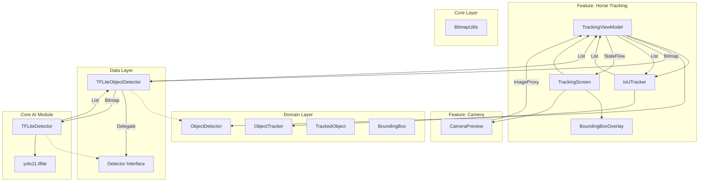

# Animal Tracking Application

CameraX와 TensorFlow Lite를 활용한 실시간 동물(말) 추적 안드로이드 애플리케이션입니다.

##  아키텍처 (Architecture)
 
이 프로젝트는 **Clean Architecture** 원칙을 따르며, **멀티 모듈(Multi-Module)** 구조로 확장성을 극대화했습니다.
 

## 모듈 구조 (Module Structure)

*   **:app**: 애플리케이션의 진입점 및 의존성 조립.
*   **:domain**: 순수 비즈니스 로직 (UseCases, Models, Interface). 플랫폼 의존성 없음.
*   **:data**: 데이터 리포지토리 구현. AI 엔진의 결과를 도메인 모델로 변환.
*   **:feature:camera**: 카메라 프리뷰/권한 처리 전용 UI.
*   **:feature:horse-tracking**: 말 추적 UI 및 화면 로직 (Compose, ViewModel).
*   **:ai**: **[New]** 독립적인 AI 탐지 라이브러리 모듈.
    *   TensorFlow Lite 로직을 캡슐화하여, 다른 앱에서도 재사용 가능하도록 설계.
*   **:core**: 공통 유틸리티 (Bitmap 처리 등).

## ⚠️ LiteRT (Android 15 호환성)

이 프로젝트는 기존 `tensorflow-lite` 라이브러리 대신 구글의 최신 **LiteRT (`com.google.ai.edge.litert`)** 라이브러리를 사용합니다.

### 이유 (Why LiteRT?)
Android 15부터 도입된 **16KB Page Size** 메모리 시스템에서 기존 TensorFlow Lite 라이브러리가 충돌하는 문제가 있습니다. LiteRT는 이를 완벽하게 지원하는 업데이트된 런타임입니다.

*   `litert`: 핵심 런타임
*   `litert-gpu`: GPU 가속 지원 (성능 최적화)
*   `litert-support`: 이미지 전처리 유틸리티

---

##  주요 기능 (Key Features)

*   **실시간 객체 탐지 (Real-time Object Detection)**: **YOLO11n** (LiteRT)을 사용하여 말을 실시간으로 탐지합니다.
*   **고성능 추론 (High Performance)**: **GPU Delegate** 및 멀티 스레딩을 적용하여 빠르고 부드러운 탐지 속도를 보장합니다.
*   **객체 추적 (Object Tracking)**: **IoU (Intersection over Union)** 기반의 트래커를 구현하여 프레임 간 객체에 고유 ID를 부여하고 추적합니다.
*   **CameraX 통합**: `ImageAnalysis`와 `STRATEGY_KEEP_ONLY_LATEST` 전략을 사용하여 카메라 프레임을 효율적으로 처리합니다.
*   **최신 UI**: **Jetpack Compose**로 완전히 구축되었으며, Bounding Box를 그리기 위한 커스텀 Canvas 오버레이를 포함합니다.

##  기술 스택 (Tech Stack)

*   **Language**: Kotlin
*   **UI**: Jetpack Compose
*   **Dependency Injection**: Hilt
*   **ML**: LiteRT (TensorFlow Lite), YOLO11
*   **Camera**: CameraX
*   **Architecture**: Clean Architecture, MVVM, Multi-Module
*   **Build**: Gradle Kotlin DSL, Version Catalogs

##  검증 (Verification)

핵심 추적 로직(`IoUTrackerTest`)에 대한 단위 테스트가 포함되어 있습니다. 다음 명령어로 실행할 수 있습니다:
