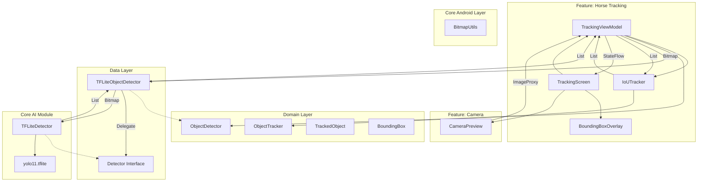

# Animal Tracking Application

CameraX와 TensorFlow Lite를 활용한 실시간 동물(말) 추적 안드로이드 애플리케이션입니다.

##  아키텍처 (Architecture)
 
이 프로젝트는 **Clean Architecture** 원칙을 따르며, **멀티 모듈(Multi-Module)** 구조로 확장성을 극대화했습니다.
 

## 모듈 구조 (Module Structure)

*   **:app**: 애플리케이션의 진입점 및 의존성 조립.
*   **:domain**: 순수 비즈니스 로직 (UseCases, Models, Interface). 플랫폼 의존성 없음.
*   **:data**: 데이터 리포지토리 구현. AI 엔진의 결과를 도메인 모델로 변환.
*   **:feature:camera**: 카메라 프리뷰/권한 처리 전용 UI.
*   **:feature:horse-tracking**: 말 추적 UI 및 화면 로직 (Compose, ViewModel).
*   **:ai**: 독립적인 AI 탐지 라이브러리 모듈.
    *   TensorFlow Lite 로직을 캡슐화하여, 다른 앱에서도 재사용 가능하도록 설계.
*   **:core-tracking**: 핵심 추적 알고리즘 (`IoUTracker`) 및 관련 데이터 모델. 순수 Kotlin 모듈로 플랫폼 독립적으로 설계됨.
*   **:core-android**: Android 전용 공통 유틸리티 (Bitmap 처리 등).

---

##  주요 기능 (Key Features)

*   **실시간 객체 탐지 (Real-time Object Detection)**: **EfficientDet/YOLO 기반 커스텀 모델 (`best_float32.tflite`)**을 사용하여 말을 실시간으로 정밀하게 탐지합니다. (640x640 해상도 최적화)
*   **지능형 객체 추적 (Advanced IoU Tracking)**:
    *   **Velocity Cap**: 물체의 이동 속도를 물리적 한계 내로 제한하여 예측 오류로 인한 '날아감 현상'을 원천 차단했습니다.
    *   **Stuck Detection**: 물체가 제자리에 멈춘 상태에서 탐지가 끊기면 즉시 추적을 종료하여 오탐지를 줄입니다.
    *   **Smart Recovery**: 물체를 잠시 놓쳐도 예측(Prediction)과 신뢰도 기반 매칭(Desperate Match)을 통해 다시 추적을 이어갑니다.
*   **CameraX 통합**: `ImageAnalysis`를 통해 고성능 프레임 처리를 지원하며, 카메라 센서의 기본 비율(4:3)을 준수하여 왜곡 없는 선명한 화질을 제공합니다.
*   **최신 UI**: **Jetpack Compose**로 완전히 구축되었으며, 부드러운 트래킹 오버레이 애니메이션을 포함합니다.

##  기술 스택 (Tech Stack)

*   **Language**: Kotlin
*   **UI**: Jetpack Compose
*   **Dependency Injection**: Hilt
*   **ML**: TensorFlow Lite (Custom Object Detection Model)
*   **Camera**: CameraX
*   **Architecture**: Clean Architecture, MVVM, Multi-Module
*   **Build**: Gradle Kotlin DSL, Version Catalogs
