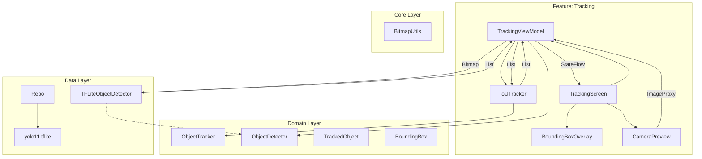

# Animal Tracking Application

CameraX와 TensorFlow Lite를 활용한 실시간 동물(말) 추적 안드로이드 애플리케이션입니다.

##  아키텍처 (Architecture)

이 프로젝트는 **Clean Architecture** 원칙을 따르며, 관심사 분리와 확장성을 보장합니다.

##  주요 기능 (Key Features)

*   **실시간 객체 탐지 (Real-time Object Detection)**: **YOLO11n** (TensorFlow Lite)을 사용하여 말을 실시간으로 탐지합니다.
*   **객체 추적 (Object Tracking)**: **IoU (Intersection over Union)** 기반의 트래커를 구현하여 프레임 간 객체에 고유 ID를 부여하고 추적합니다.
*   **CameraX 통합**: `ImageAnalysis`와 `STRATEGY_KEEP_ONLY_LATEST` 전략을 사용하여 카메라 프레임을 효율적으로 처리합니다.
*   **최신 UI**: **Jetpack Compose**로 완전히 구축되었으며, Bounding Box를 그리기 위한 커스텀 Canvas 오버레이를 포함합니다.

##  기술 스택 (Tech Stack)

*   **Language**: Kotlin
*   **UI**: Jetpack Compose
*   **Dependency Injection**: Hilt
*   **ML**: TensorFlow Lite, YOLO11
*   **Camera**: CameraX
*   **Architecture**: Clean Architecture, MVVM, UDF (Unidirectional Data Flow)
*   **Build**: Gradle Kotlin DSL, Version Catalogs, Composite Build (`build-logic`)

##  검증 (Verification)

핵심 추적 로직(`IoUTrackerTest`)에 대한 단위 테스트가 포함되어 있습니다. 다음 명령어로 실행할 수 있습니다:
